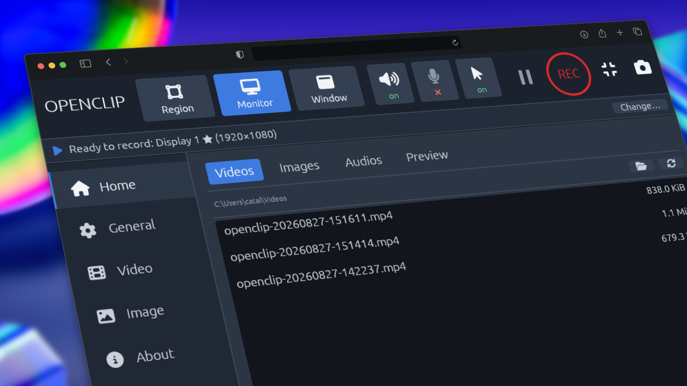

# openclip



A small, self-contained screen recorder written in Rust with an [egui](https://github.com/emilk/egui) GUI.

- Records a **whole monitor**, a **single window**, or a **dragged region**
- Captures **system audio** (what you hear) and/or a **microphone**
- **Live preview** of what is being recorded
- Writes a standard **MP4** (H.264 video + MP3 audio) that plays in VLC, Windows Media Player / Movies & TV, Chrome/Edge and ffmpeg-based tools
- **No external runtime dependencies**: no ffmpeg, no system codecs. The H.264 encoder ([OpenH264](https://www.openh264.org/)) and the MP3 encoder ([LAME](https://lame.sourceforge.io/)) are compiled from bundled sources at build time, and the MP4 muxer is in-house.

## Building

```sh
cargo build --release
./target/release/openclip
```

You need a Rust toolchain (edition 2024 → Rust 1.85+) and a C/C++ compiler for the bundled codecs:

| Platform | Requirements |
|---|---|
| Windows | Visual Studio Build Tools (MSVC). Nothing else. |
| macOS | Xcode command-line tools, plus `autoconf automake libtool` (LAME builds via autotools). macOS 13+ for capture; system-audio loopback needs macOS 14.6+. |
| Linux | `build-essential autoconf automake libtool` and the dev headers used by eframe / xcap / cpal: `libxcb-render0-dev libxcb-shape0-dev libxcb-xfixes0-dev libxkbcommon-dev libssl-dev libxcb1-dev libxrandr-dev libdbus-1-dev libpipewire-0.3-dev libasound2-dev`. X11 only for now (see limitations). |

Installing [nasm](https://www.nasm.us/) before building enables OpenH264's assembly kernels and roughly doubles encoder throughput; without it the build silently falls back to C.

## Usage

The window is laid out like a classic recorder (about 800×640): a toolbar on top, a navigation on the left (Home / General / Video / Image / About) and pages on the right.

1. **Toolbar** – pick a recording mode (**Region** opens the on-screen selector: drag a rectangle, Esc cancels; **Monitor**; **Window**), toggle **system audio**, **microphone** and **cursor**, then press the round **REC** button. **⏸** pauses and resumes (paused time is cut out of the file, video and audio stay in sync); the camera button saves a PNG snapshot.
2. **Home** – a file browser for your output folder with **Videos / Images / Audios** tabs (newest first, with sizes; double-click or **Play** opens the file, **Folder** reveals it, **Delete** asks for confirmation). The **Preview** tab shows a live view of exactly what will be recorded — cursor and mouse effects included — together with the monitor/window/region selector; the preview capture only runs while that tab is open. The status strip's **Change…** button jumps there.
3. **Video** has three tabs: **Record** (cursor / click / highlight toggles, size, and the format summary boxes), **Format** (codec, frame rate, bitrate, size; system audio, microphone and device) and **Mouse** (mouse effects, below). **General** sets the output folder and file-name prefix.
4. **Mini bar** – the ▭ toolbar button collapses the window into a small always-on-top bar (Camtasia-style) with the recording area, the input toggles, pause / REC and a restore button; drag it by its background to move it out of the recorded area.
5. Press **REC** again (it turns into a stop button) to finish. Files are written as `<prefix>-YYYYMMDD-HHMMSS.mp4` into the chosen folder (defaults to `~/Videos`).

"Half size" halves both dimensions, which is the easiest way to keep up on slow machines or 4K displays. The status strip shows elapsed (recorded) time, encoded fps, dropped frames and file size while recording. Frames are dropped (never desynchronised) when the encoder cannot keep up, and the encoder may skip frames to hold the bitrate; each frame carries its real capture timestamp, so playback timing stays correct either way. When the screen is static the last frame is re-encoded at the target rate so the video keeps a steady cadence.

### Mouse effects

The **Video → Mouse** tab mirrors the classic "mouse effects" panel:

- **Show mouse cursor** with a **Size** (50–300 %). At 100 % the real cursor is captured natively (exact shape); at any other size the app hides the native cursor and draws its own scalable arrow.
- **Click effect** – an expanding ring on every press, with separate **left / right click colours** and a size.
- **Highlight effect** – a translucent halo that follows the pointer, with colour, size and opacity.
- A checkerboard **preview** shows the current settings; click inside it to test the click effect.

Effects are painted onto the captured frames themselves (in the encode thread, and in the live preview), so the recording and the preview always match. The global pointer is read through `device_query`; on Linux this needs X11 (`libx11-dev` at build time).

### Headless examples

```sh
cargo run --release --example capture_to_mp4 -- 10 out.mp4      # record the primary monitor for 10 s
                                    # flags: --half --mic --no-audio --fx --region X,Y,W,H --window TITLE --pause-at S --resume-at S
cargo run --release --example bench_encode -- 1920 1080 5       # encoder throughput on synthetic content
```

## How it works

```
capture backend ──RawFrame──▶ encode thread ──▶ OpenH264 ──▶ MP4 muxer ──▶ file
                                   ▲                             ▲
cpal (mic / loopback) ──▶ mixer ───┴──▶ LAME MP3 ────────────────┘
```

- **Capture** (`src/capture`): Windows uses Windows.Graphics.Capture via `windows-capture` (BGRA frames, GPU-side crop for regions). macOS and Linux/X11 use `xcap`'s video recorder for monitors and screenshot polling for windows. Monitor/window enumeration and the region-picker backdrop use `xcap` everywhere.
- **Video** (`src/video`): BGRA/RGBA → I420 with the SIMD `yuv` crate, then OpenH264 in screen-content real-time mode. Annex-B output is converted to AVCC length-prefixed samples; SPS/PPS go into `avcC`.
- **Audio** (`src/audio`): each cpal stream pushes timestamped chunks; the mixer places them on the recording timeline (inserting silence for gaps such as WASAPI loopback going quiet), resamples to 48 kHz stereo, and feeds LAME. An MP3 frame splitter makes each MP4 sample exactly one 1152-sample frame.
- **Mux** (`src/mux`): a streaming, non-fragmented MP4 writer (`ftyp` / 64-bit `mdat` / `moov`) with per-sample durations from real timestamps, keyframe table, 0.5 s interleaved chunks and `co64` for files over 4 GiB. The integration test round-trips output through the independent `mp4-atom` parser.

## Limitations (v1)

- **Wayland** is not supported (xcap limitation); use an X11 session.
- **Window capture on macOS/Linux** polls screenshots and is slower than monitor capture; on Windows it is native.
- **System audio on Linux** has no loopback API in cpal; select a PulseAudio/PipeWire monitor source as the input device instead.
- If a captured window is **resized** mid-recording, frames of the new size are skipped (the encoder keeps the original dimensions).
- Without `nasm`, OpenH264 manages roughly 25–30 fps at 1080p on high-entropy content on a modern desktop CPU; typical desktop content is much cheaper. Use "Half resolution" or a lower frame rate if you see drops.

## Licensing notes

The code is Apache-2.0. Bundled third-party encoders: OpenH264 (BSD-2-Clause) and LAME (LGPL-2.1+). UI icons are Font Awesome Free (SIL OFL 1.1 font, CC BY 4.0 icons — `assets/fonts/FONT-AWESOME-LICENSE.txt`). Note that Cisco's MPEG-LA H.264 patent coverage applies only to the binary they distribute, not to source builds like this one; whether that matters depends on your jurisdiction and use.
